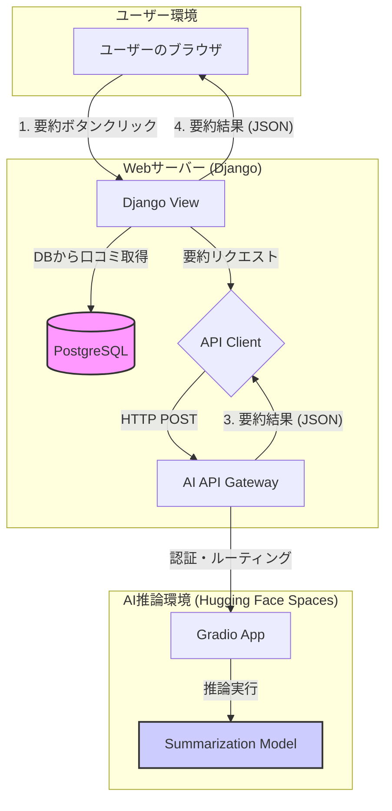
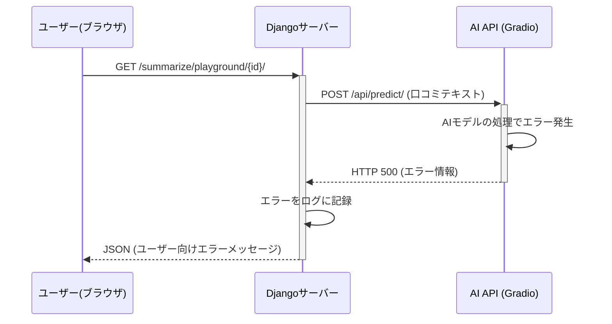

# AI API 開発ガイド

このドキュメントは、Hugging Face SpacesとGradioを利用したAI APIの開発環境構築と、その後の開発プロセスに関する要点をまとめたものです。

## 1. 概要

### 1.1. 目的と機能概要

本プロジェクトの目的は、「親子で遊ぼうナビ」にAIを活用した**口コミの自動要約機能**を実装することです。

- **目的:** ユーザーが多数の口コミを全て読んでも、施設の全体的な評判を素早く、かつ客観的に把握できるようにする。
- **ユーザー体験:**
    1. ユーザーは施設の詳細ページで「口コミをAI要約」ボタンをクリックします。
    2. AIがその施設の全口コミを分析し、「ポジティブな点」と「注意が必要な点」などをまとめた中立的な要約文を生成します。
    3. 生成された要約がモーダルウィンドウ等で表示され、ユーザーは短時間で施設の長所と短所を理解できます。

### 1.2. アーキテクチャ概要

この機能は、Djangoアプリケーションと、Hugging Face Spaces上で動作するGradio APIとの連携によって実現します。

- **開発環境:** Dockerコンテナ内で開発・テストを行う。
- **バージョン管理:** Gitでコードを管理する。
- **CI/CD:** GitHub Actionsでテストとデプロイを自動化する。
- **本番環境:** Hugging Face Spacesにデプロイし、APIを公開する。

### 1.3. 技術選定理由

- **Hugging Face Spaces:**
    - **選定理由:** 無料枠が利用可能で、迅速なプロトタイピングに適しています。また、GitHubリポジトリと連携した自動デプロイ機能（CI/CD）が標準で提供されており、開発体験が非常にスムーズです。
    - **代替案との比較:** AWS LambdaやGoogle Cloud Functionsのようなサーバーレス環境も考えられますが、これらはコンテナイメージのサイズ制限が厳しく、大規模なAIモデルのデプロイには追加の工夫が必要です。Hugging Face Inference APIは最も手軽ですが、カスタムロジックの追加やUIの提供ができないため、今回はGradioと組み合わせられるSpacesを選択しました。
- **Gradio:**
    - **選定理由:** 数行のコードでAIモデルのデモUIとAPIエンドポイントを同時に作成できるため、開発速度を大幅に向上させます。特に、動作確認用のUIが自動で生成される点は、開発初期段階での実験やデバッグにおいて大きな利点となります。

### 1.4. アーキテクチャ図



---

## 2. プロジェクト構造と開発環境

保守性・拡張性を高めるため、役割ごとにファイルを分割したディレクトリ構造を採用し、Dockerで開発環境を構築します。

### 2.1. 推奨ディレクトリ構造

```
kids-playground-ai-api/
│
├── .github/
│   └── workflows/
│       └── ci.yml
│
├── .gitignore
├── Dockerfile
├── pyproject.toml
├── requirements.txt
├── README.md
│
├── docs/
│   └── ai_api_development_guide.md # ★この開発ガイド
│
├── src/
│   └── ai_api/
│       ├── __init__.py
│       ├── main.py         # APIエントリーポイント (Gradio UI)
│       ├── core/
│       │   ├── __init__.py
│       │   └── inference.py  # AI推論ロジック
│       └── config.py       # 設定ファイル
│
└── tests/
    └── core/
        └── test_inference.py
```

### 2.2. 品質管理ツールの設定

- **`pyproject.toml`:** プロジェクトルートに作成し、Ruff (フォーマッター/リンター), Mypy (型チェッカー), Pytest (テストフレームワーク) の設定を記述します。
- **`.pre-commit-config.yaml`:** `pre-commit`を導入し、Gitコミット時に自動でコードチェックが走るように設定します。

### 2.3. 開発環境 (Docker)

- **`requirements.txt`:** 必要なライブラリを記述します。
- **`Dockerfile`:** ローカル開発環境の統一と効率化のために使用します。
    - **注記:** この`Dockerfile`は、あくまでローカル開発用です。デプロイ先のHugging Face Spacesでは、`Dockerfile`は直接使われず、`requirements.txt`に基づいて環境が自動構築されます。
- **`docker-compose.yml`:** DjangoサーバーとAI APIサーバーなど、複数のサービスを定義し、一括で起動・管理するために使用します。
- **Docker Desktopの活用:** WindowsやMacのユーザーは、Docker Desktopを利用することで、コンテナの状態をGUIで視覚的に確認したり、起動・停止を容易に行うことができます。Linuxユーザーも利用可能です。コマンドライン操作に慣れていない開発者には、Docker Desktopの利用を推奨します。

#### 2.3.1. ローカル環境の起動とアクセス

開発を開始するには、プロジェクトのルートディレクトリで以下のコマンドを実行します。Docker Desktopを利用している場合は、GUI上から `docker-compose.yml` を指定して起動することも可能です。

```bash

# -d フラグでバックグラウンドで起動
docker-compose up --build -d
```

これにより、各サービスがコンテナとして起動します。
- **Djangoアプリケーション:** `http://localhost:8000`
- **AI API (Gradio):** `http://localhost:7860`

### 2.4. デバッグ方法

コンテナ内で問題が発生した場合、以下のコマンドでコンテナの内部に入り、デバッグ作業を行うことができます。

```bash

# <service_name> は docker-compose.yml で定義したサービス名 (例: web, api)
docker-compose exec <service_name> bash
```

コンテナ内では、ログファイルの確認、Pythonのインタラクティブシェルを起動してのコード実行などが可能です。

---

## 3. モデル管理

- **モデル選定:** まずは速度とリソースのバランスが良い軽量なモデル（例: `llm-jp/t5-small-japanese-finetuned-sum`）で開発を開始し、必要に応じて、より高品質なモデル（例: `izumi-lab/t5-base-japanese-summary`）への差し替えを検討します。
- **情報記録:** `config.py`には、モデル名だけでなく、モデルサイズ、ライセンス、推論速度の目安などの情報もコメントとして記録し、管理します。

---

## 4. 実装の役割分担

- **`src/ai_api/config.py` (設定担当):** モデルやパラメータの情報を管理します。
- **`src/ai_api/core/inference.py` (AI推論担当):** AIモデルのロードと推論のコアロジックを実装します。
- **`src/ai_api/main.py` (API受付担当):** GradioのUIを定義し、サーバーを起動します。Dockerコンテナ内で外部にAPIを公開するため、`iface.launch(server_name="0.0.0.0")`のように起動オプションを指定します。

### AI新機能開発におけるコーディング規約

AI新機能の開発においては、以下のコーディング規約と開発原則を遵守し、高品質で保守性の高いコードベースを目指します。

#### 1. Pythonコーディング規約

*   **PEP 8準拠**: PythonコードはPEP 8スタイルガイドに厳密に準拠します。`flake8` および `black` による自動フォーマットとリントを徹底し、コードの一貫性を保ちます。
*   **型ヒントの活用**: `mypy` を用いた型チェックを徹底し、コードの堅牢性、可読性、およびIDEによる補完の恩恵を最大化します。
*   **Djangoとの連携**: AI機能がDjangoアプリケーションと連携する場合、Djangoのモデル、ビュー、フォーム、URLパターンなどの既存の命名規則と構造に準拠し、シームレスな統合を図ります。
*   **AI/MLコードの構造**:
    - データ処理（前処理、特徴量エンジニアリング）、モデル定義、学習ロジック、推論ロジックは明確に分離し、それぞれが単一の責務を持つモジュールとして設計します。
    - 設定値やハイパーパラメータはコードから分離し、Djangoの`settings.py`、または専用のYAML/JSONファイルなどで一元的に管理します。
*   **ドキュメンテーション**: 関数、クラス、複雑なアルゴリズム、およびAIモデルの設計意図には、適切なDocstringを記述し、コードの意図と振る舞いを明確にします。
*   **エラーハンドリング**: 予期せぬエラーや例外処理は、Djangoの標準的なエラーハンドリングやPythonの例外処理メカニズムに従い、適切にログを出力し、システムの安定性を確保します。
*   **保守性と可読性**: コードは常に保守性と可読性を最優先に設計・実装します。複雑なロジックは小さな関数に分割し、変数名や関数名は意図が明確に伝わるように命名します。
*   **単一責務の原則 (SRP)**: クラスや関数は、変更の理由が一つであるように設計します。これにより、コードの凝集度を高め、テスト容易性と再利用性を向上させます。

#### 2. テスト駆動開発 (TDD) とテストの考え方

*   **t_wada氏のTDDスタイル**: 開発は「Red → Green → Refactor」のTDDサイクルを厳守して進めます。
    - **Red**: 最初に失敗するテストを記述し、必要な機能の振る舞いを定義します。
    - **Green**: テストが成功する最小限のコードを実装します。
    - **Refactor**: コードの品質を向上させ、重複を排除し、設計を改善します。
*   **「動く仕様書」としてのテスト**: テストコードは、単なる品質保証の手段ではなく、機能の振る舞いを明確に記述した「動く仕様書」として機能するように設計します。
    - テストケース名（`pytest`のテスト関数名など）は、**日本語で**「〜という状況で、〜という振る舞いをすべき」というように、具体的なシナリオと期待される結果を記述します。
    - テストは実装の詳細ではなく、機能の**振る舞い（Behavior）**に焦点を当てます。

---

## 5. テスト戦略

- **ユニットテスト:** `pytest`を使い、`inference.py`内の純粋な関数（AIのコアロジック）をテストします。
- **インテグレーションテスト:** ローカルで起動したGradioサーバーに対し、`requests`ライブラリで実際にAPIリクエストを送り、HTTPステータスコードやレスポンスの形式が期待通りであることを確認するテストも追加します。これにより、APIとしての正常性を保証します。

---

## 6. CI/CDとデプロイ戦略

### 6.1. 推奨ワークフロー
1.  **CI (GitHub Actions):** プルリクエスト作成時や`main`ブランチへのプッシュ時に、GitHub Actionsを起動し、`pytest`による自動テスト（ユニットテストとインテグレーションテスト）を実行します。
2.  **CD (GitHub Actionsによるデプロイ):** テストが成功したコードが`main`ブランチにマージされたら、GitHub ActionsのワークフローがHugging Faceのアクセストークンを使って、Hugging Face Spacesのリポジトリに直接`git push`します。これにより、デプロイが自動的に実行されます。

### 6.2. 設定
- **GitHub Actions:** `.github/workflows/ci.yml`にテストとデプロイのワークフローを定義します。
- **Hugging Face Hub & GitHub Secrets:**
  1.  Hugging Faceの個人設定で、`write`権限を持つアクセストークンを発行します。
  2.  発行したトークンを、GitHubリポジトリの`Settings > Secrets and variables > Actions`に`HF_TOKEN`として登録します。
  3.  `ci.yml`内のデプロイジョブは、この`HF_TOKEN`を安全に利用してHugging Faceへの認証を行います。

---

## 7. セキュリティと利用制限

### 7.1. API認証

**課題:** Hugging Face Spacesで公開されるAPIは、デフォルトでは誰でもアクセス可能な状態になります。意図しない利用や攻撃を防ぐため、Djangoアプリケーションからのみリクエストを受け付けるように制御する必要があります。

**対策:** APIキーによる認証を導入します。
1.  **APIキーの生成:** UUIDなどで推測困難な文字列をAPIキーとして生成します。
2.  **Secretsへの登録:** 生成したキーを、DjangoとGradio APIの両方の環境変数（Hugging Face SpacesのSecrets）として登録します。
    - `AI_API_KEY`: Gradio側でリクエストを検証するためのキー
    - `DJANGO_AI_API_KEY`: Djangoがリクエスト時に送信するキー
3.  **認証の実装:**
    - **Django側:** APIを呼び出す際、HTTPヘッダー（例: `Authorization: Bearer <APIキー>`）にAPIキーを含めて送信します。
    - **Gradio側:** FastAPIの依存性注入（`Depends`）などを利用して、リクエストヘッダーをチェックする認証関数を定義します。APIキーが一致しない場合は、HTTP 401または403エラーを返却します。

### 7.2. その他の対策

- **Abuse対策:** 公開APIが悪用されるのを防ぐため、Gradioの`queue()`メソッドを利用してリクエストを待ち行列に入れ、同時アクセス数を制限することを検討します。
- **免責事項:** `README.md`に、APIの利用は自己責任であること、生成される内容の正確性を保証しないこと、商用利用に関する制限などを明記しておきます。

---

## 8. 今後の開発プロセス

このドキュメントは、今後の調査や開発の進捗に応じて、継続的に更新・メンテナンスされます。

---

## 9. 設計

このセクションでは、機能実装の前に定義するべき、より詳細な設計について記録します。

### 9.1. APIインターフェース設計 (口コミ要約機能 v1)

DjangoとGradio APIがやり取りするデータ形式とルールを以下のように定めます。

#### 9.1.1. 基本方針
- **通信プロトコル:** HTTP/HTTPS
- **データ形式:** JSON
- **基本構造:** Gradioの標準API形式に準拠します。

#### 9.1.2. リクエスト仕様 (Django → Gradio API)
- **エンドポイント:** `(SpaceのURL)/api/predict/`
- **HTTPメソッド:** `POST`
- **ボディ (JSON):**
  ```json
  {
    "data": [
      "口コミ全文を結合した文字列..."
    ]
  }
  ```

#### 9.1.3. レスポンス仕様 (Gradio API → Django)
**成功時 (HTTP 200 OK):**
- **ボディ (JSON):**
  ```json
  {
    "data": [
      "AIによって生成された要約文..."
    ],
    "duration": 3.5
  }
  ```

**失敗時 (HTTP 500 Internal Server Error):**
- **ボディ (JSON):**
  ```json
  {
    "error": "Gradio側で設定したエラーメッセージ"
  }
  ```

### 9.2. UI/UX設計 (口コミ要約機能 v1)

ユーザーが機能を直感的に利用でき、システムの応答を快適に待てるように、以下の通りUI/UXを設計します。

#### 9.2.1. 操作フロー
1.  **トリガー:** ユーザーが施設詳細ページの「口コミをAI要約」ボタンをクリックします。
2.  **ローディング:** ボタンが無効化され、「生成中です...」というテキストとスピナー（回転するアイコン）が表示されます。これにより、処理中であることがユーザーに明確に伝わります。
3.  **結果表示:** 要約が完了すると、**Bootstrapのモーダルウィンドウ**が画面中央に表示され、その中に生成された要約文が提示されます。
4.  **完了:** ユーザーはモーダルを閉じて、元のページ閲覧を続けます。ローディング表示は元のボタン表示に戻ります。

#### 9.2.2. エッジケースの対応
- **口コミが少ない場合:**
    - **条件:** Django側で、対象施設の口コミが3件未満の場合。
    - **処理:** AIのAPIは呼び出さず、即座に「口コミが3件未満のため、要約できません。」というアラートメッセージを表示します。これにより、不要なAPIコールを防ぎ、ユーザーに状況を的確に伝えます。
- **APIエラー発生時:**
    - **条件:** APIのタイムアウトやサーバーエラーが発生した場合。
    - **処理:** 「AIサーバーで問題が発生しました。時間をおいて再度お試しください。」といった内容をアラートまたはモーダルで表示します。

### 9.3. データ処理・ビジネスロジック設計 (v1)

AIの性能を最大限に引き出し、安定した運用を行うための内部ルールを以下のように設計します。

#### 9.3.1. 入力データの前処理 (Django側)
- **口コミの結合:** 複数の口コミは、それぞれを独立した段落としてAIに認識させるため、2つの改行文字 (`\n\n`) で区切って1つのテキストに結合します。
- **ノイズ除去:** 絵文字やURLなど、要約のノイズとなりうる不要な文字列は、正規表現を用いて事前に除去します。

#### 9.3.2. 要約実行の判断ロジック (Django側)
以下の条件を満たさない場合は、APIを呼び出さずにエラーとして処理します。
- **最小口コミ件数:** 3件以上
- **最小総文字数:** 全体の文字数が300文字以上

#### 9.3.3. AIモデルの推論パラメータ (Gradio API側)
生成される要約文の品質を制御するため、以下の初期パラメータを設定します。これらの値は `config.py` で管理し、調整可能にします。
- **要約文の最小長 (`min_length`):** 50
- **要約文の最大長 (`max_length`):** 250
- **長さペナルティ (`length_penalty`):** 2.0 (冗長な表現を抑制)

#### 9.3.4. 大量データへの対応方針
- **初期実装:** まずは全ての口コミを結合してAPIに送信します。モデルの最大入力長を超える場合は、`truncation=True` オプションにより自動的に末尾が切り捨てられます。
- **将来的な改善:** 性能やコストに問題が見られた場合、「直近1年間の口コミのみを対象とする」などの制限を後から追加することを検討します。

### 9.4. エラーハンドリング設計 (v1)

予期せぬ事態が発生した場合でもシステムが安定して動作し、ユーザーに適切なフィードバックを返せるよう、以下の通りエラーハンドリングを設計します。

#### 9.4.1. エラー発生源と対応方針

| 発生場所 | エラー例 | 対応方針 | ユーザーへの通知例 |
| :--- | :--- | :--- | :--- |
| **Gradio API** | モデルのロード失敗、推論中のエラー | `try...except`で捕捉し、HTTP 500とエラー内容をJSONで返す。 | (Django経由で)「AIサーバーで問題が発生」 |
| **Django ⇔ Gradio API間** | ネットワーク障害、タイムアウト | Djangoの`requests`部分で`try...except`で捕捉し、エラーをログ記録。 | 「AIサーバーに応答がありません」 |
| **Django** | DB接続エラー、口コミ件数不足 | `try...except`や条件分岐で対応。口コミ不足はHTTP 400を返す。 | 「サーバーでエラーが発生」、または「口コミが不足」 |
| **ブラウザ ⇔ Django間** | ユーザーのオフライン | jQuery Ajaxの`.fail()`コールバックで捕捉。 | 「通信に失敗しました」 |

#### 9.4.2. 実装のポイント
- **Django (司令塔) の役割:**
    - Djangoのビューは、Gradio APIとの通信部分を必ず`try...except`ブロックで囲み、タイムアウト（例: 30秒）を設定します。
    - APIから返されたHTTPステータスコードを常にチェックし、200番台以外はエラーとして処理します。
    - 発生したエラーは、**必ずサーバーログに記録**し、原因調査に役立てます。
    - ユーザーには、技術的なエラー詳細（スタックトレース等）を直接見せず、「AIサーバーで問題が発生しました」のような抽象的で分かりやすいメッセージを返します。

- **Gradio API (専門家) の役割:**
    - AIの推論処理など、失敗する可能性のあるコードは`try...except`ブロックで囲みます。
    - エラー発生時は、`raise gr.Error("具体的なエラー原因")`を呼び出し、APIの契約通りにエラー情報を返却します。

### 9.5. 詳細設計: AI推論コア (`core/inference.py`) (v1)

AI推論のコアロジックは、保守性とテスト容易性を高めるために、いくつかの設計原則とデザインパターンを適用して構造化します。

#### 9.5.1. クラス設計と責務
- **`Summarizer` クラスの導入:** AIの推論に関連する全てのロジックを、単一の`Summarizer`クラスに集約します。このクラスは**「AIモデルを管理し、テキスト要約を実行する」**という明確な責務を持ちます。

#### 9.5.2. 適用するデザインパターン
- **ファサード (Facade) パターン:** `Summarizer`クラスは、`transformers`ライブラリの複雑な内部処理（モデルのロード、トークナイズ、推論、デコード等）をカプセル化（隠蔽）します。そして、`summarize(text)`という非常にシンプルなメソッドのみを外部に公開します。これにより、利用側（`main.py`）はAIの複雑な詳細を意識することなく、簡単かつ安全に要約機能を利用できます。

- **依存性の注入 (Dependency Injection) によるインスタンス管理:** AIモデルのようなリソースを大量に消費するオブジェクトは、リクエストごとに生成するべきではありません。代わりに、アプリケーションの起動時に一度だけ`Summarizer`のインスタンスを生成し、それを必要とする各コンポーネント（APIのエンドポイント関数など）に**注入（引数として渡す）**します。
    - **なぜシングルトンを避けるか:** ご指摘の通り、グローバルな単一インスタンス（シングルトン）に依存する設計は、コンポーネント間の結合を強め、テストを困難にするためアンチパターンと見なされます。このアプローチは避けるべきです。
    - **具体的な実現方法:** アプリケーションのエントリーポイント（`main.py`）で`Summarizer`インスタンスを生成し、`functools.partial`などを用いて、APIを処理する関数にそのインスタンスをあらかじめ渡しておくことで、グローバルな状態を持つことなくインスタンスの共有を実現します。これにより、テスト容易性と設計の柔軟性が大幅に向上します。
    - **設定値の注入:** このDIパターンは、`Summarizer`クラスが使用するモデル名や要約の長さといった設定値をコンストラクタを通じて外部の`config`モジュールから受け取るという、元々の依存性注入の考え方とも一致しています。

#### 9.5.3. エラーハンドリング方針
- `Summarizer`クラス内で発生したエラー（モデルのロード失敗、推論失敗など）は、クラス内部で適切に捕捉され、呼び出し元がハンドリングしやすいように、専用の例外（例: `InferenceError`）として再送出する設計とします。

### 9.6. 詳細設計: 設定管理 (`config.py`) (v1)

設定値をコードから分離し、安全かつ構造的に管理するため、以下の通り設計します。

#### 9.6.1. 設計方針
- **データクラスの活用:** Python標準の`dataclasses`を用い、関連する設定項目をグループ化した設定クラス（例: `ModelConfig`）を定義します。これにより、型安全性が保証され、コード補完も効くため開発効率が向上します。
- **不変性の確保:** 作成したデータクラスは `@dataclass(frozen=True)` を指定し、イミュータブル（変更不可能）にします。これにより、アプリケーション実行中に意図せず設定が変更されてしまう危険な状態を防ぎます。
- **環境変数による設定の上書き:** 将来的な拡張性（例: APIキーの管理）を見据え、設定値は環境変数から取得することを基本とします。開発環境では`.env`ファイルを利用し、本番環境では実行環境（Hugging Face Spacesなど）のSecrets機能で設定を注入する運用を想定します。

    - **`.env.example` の提供:** 開発者が環境変数を容易に設定できるよう、リポジトリには `.env.example` ファイルを含めます。実際の開発では、このファイルをコピーして `.env` を作成し、値を設定します。

      ```.env.example
      # AI APIのモデル名を指定
      AI_MODEL_NAME="llm-jp/t5-small-japanese-finetuned-sum"
      ```

    - **`docker-compose.yml` での読み込み:** `docker-compose.yml` ファイルで `env_file` を指定することで、コンテナ起動時に `.env` ファイルの内容が環境変数として読み込まれます。

      ```yaml
      services:
        api:
          build: .
          env_file:
            - .env
      ```

#### 9.6.2. 構造案
- **`ModelConfig` クラス:**
    - **責務:** 使用するAIモデルに関する情報を一元管理します。
    - **属性案:** `NAME` (モデル名), `REVISION` (バージョン)
- **`InferenceConfig` クラス:**
    - **責務:** AIの推論（要約生成）時のパラメータを一元管理します。
    - **属性案:** `MIN_LENGTH`, `MAX_LENGTH`, `LENGTH_PENALTY`, `NUM_BEAMS`

### 9.7. 詳細設計: Django側ビュー (`summary_views.py`) (v1)

Django側でAI APIを呼び出すビューは、責務を明確に分離し、堅牢なエラーハンドリングとロギングを組み込んだクラスとして設計します。

#### 9.7.1. 設計方針
- **クラスベースビュー (CBV) の採用:** Django標準の`django.views.View`を継承したクラスとして実装します。これにより、将来的な機能拡張（例: POSTメソッドの追加）にも柔軟に対応できます。
- **責務の分離:** 1つのメソッドに全てのロジックを記述するのではなく、「口コミの取得」「バリデーション」「API呼び出し」といった関心事ごとにプライベートメソッド（例: `_call_api`）へ処理を分割し、メインの`get`メソッドの見通しを良くします。
- **集中的なエラーハンドリング:** メインの`get`メソッドに`try...except`ブロックを設け、各処理で発生しうる例外（DB関連、通信関連など）を集中的に捕捉し、適切な`JsonResponse`を返すようにします。
- **詳細なロギング:** Pythonの`logging`モジュールを活用し、API呼び出しの成否、発生したエラー、ビジネスロジックの判断などをログに出力します。特にエラー発生時には、スタックトレースを含めて記録することで、迅速な原因究明を可能にします。

#### 9.7.2. クラス・メソッド構成案
- **`SummarizeReviewsView(View)`**
    - **`get(self, request, playground_id)`:**
        - HTTP GETリクエストを処理するメインメソッド。
        - 以下の処理フローを制御する。
            1. `_get_reviews`を呼び出し、口コミデータを取得。
            2. `_validate_reviews`を呼び出し、ビジネスルール（件数、文字数）を検証。
            3. 口コミテキストを前処理（結合、ノイズ除去）。
            4. `_call_summary_api`を呼び出し、外部APIと通信。
            5. 成功レスポンスまたはエラーレスポンスを`JsonResponse`として返す。
    - **`_get_reviews(self, playground_id)`:**
        - `playground_id`に対応する口コミをデータベースから取得する責務を持つ。
    - **`_validate_reviews(self, reviews)`:**
        - 取得した口コミが要約実行の条件を満たすか検証する責務を持つ。
    - **`_call_summary_api(self, text)`:**
        - `requests`ライブラリを使い、Gradio APIとの通信を行う責務を持つ。タイムアウト設定もここで行う。

#### 9.7.3. 設定値の管理
- Gradio APIのエンドポイントURLやタイムアウト秒数といった設定値は、`settings.py`に記述し、ビューからは`django.conf.settings`を通じて参照します。これにより、設定の一元管理を実現します。

### 9.8. 詳細設計: テスト戦略の具体化 (v1)

アプリケーションの品質と信頼性を保証するため、以下の通り多層的なテスト戦略を設計します。

#### 9.8.1. テストの種類と目的
- **ユニットテスト (Unit Tests):**
    - **目的:** 個々の部品（クラス、メソッド）が単体で正しく動作することを検証します。高速に実行できるため、開発中の頻繁な確認に適しています。
    - **対象:** `core/inference.py` の `Summarizer` クラスなど、ビジネスロジックの中核を担う部分。
- **インテグレーションテスト (Integration Tests):**
    - **目的:** Gradio APIのエンドポイントが、APIの契約通りに正しくリクエストを処理し、レスポンスを返すことを検証します。コンポーネント間の連携を確認します。
    - **対象:** ローカルで起動したGradioアプリケーションの `/api/predict/` エンドポイント。

#### 9.8.2. テストケースの計画
- **ユニットテスト (`tests/core/test_inference.py`):**
    - **正常系:** 通常のテキストが入力された場合に、期待される形式（文字列）の要約が返ることを確認する。
    - **異常系:** 空文字列や不正なデータ型が入力された場合に、設計通り`ValueError`等の例外が発生することを確認する。
- **インテグレーションテスト (`tests/test_api.py`):**
    - **正常系:** APIに有効なリクエストを送信し、HTTPステータスコード`200`と、設計通りのJSONレスポンスが返ることを確認する。
    - **異常系:** 不正なリクエストを送信した場合に、適切なHTTPエラーステータスコード（例: `4xx`）が返ることを確認する。

#### 9.8.3. テストの効率化
- **フィクスチャの活用 (`@pytest.fixture`):** AIモデルのロードは時間がかかるため、`Summarizer`クラスのインスタンス生成をフィクスチャとして定義します。`scope="session"`を指定することで、全テスト実行中にモデルのロードが一度だけで済み、テスト時間を大幅に短縮します。
- **パラメータ化の活用 (`@pytest.mark.parametrize`):** 複数の異なる入力値と期待される結果の組み合わせを、一つのテスト関数で効率的に検証するために使用します。

### 9.9. 詳細設計: Django-AI連携 (v1)

DjangoアプリケーションとAIアプリケーション（Gradio）がどのように連携して機能を実現するかの具体的な設計を以下に示します。

#### 9.9.1. 連携シーケンス

##### 正常系のシーケンス

全体の処理の流れは以下の通りです。

```mermaid
sequenceDiagram
    participant Browser as ユーザー(ブラウザ)
    participant Django as Djangoサーバー
    participant Gradio as AI API (Gradio)

    Browser->>+Django: GET /summarize/playground/{id}/
    Django->>Django: 1. 口コミ取得・検証
    alt 口コミが3件未満など条件を満たさない
        Django-->>-Browser: JSON (エラー)
    end
    Django->>+Gradio: POST /api/predict/ (口コミテキスト)
    Gradio->>Gradio: 2. AIモデルで要約実行
    Gradio-->>-Django: JSON (要約結果)
    Django-->>-Browser: JSON (要約結果)
```

##### 異常系（AI APIエラー）のシーケンス

AI API側でエラーが発生した場合の処理の流れです。



#### 9.9.2. 各コンポーネントの責務と実装

**1. Django側 (`myapp/views/summary_views.py`)**

- **クラス:** `SummarizeReviewsView(View)`
- **メソッド:** `get(self, request, playground_id)`
    - **責務:** リクエストを受け付け、AI APIとの通信を制御する司令塔。
    - **処理フロー:**
        1.  DBから口コミを取得し、件数や文字数を検証する。
        2.  `_call_summary_api` メソッドを呼び出し、AI APIにリクエストを送信する。
        3.  返ってきた結果（成功またはエラー）を整形し、`JsonResponse`としてフロントエンドに返す。
- **メソッド:** `_call_summary_api(self, text)`
    - **責務:** `requests`ライブラリを用いて、AI APIとのHTTP通信を実際に担当する。
    - **実装詳細:**
        - `settings.AI_SUMMARY_API_URL` からAPIのエンドポイントURLを取得する。
        - `requests.post()` を使い、タイムアウトを設定してPOSTリクエストを送信する。
        - 通信エラーや、APIが返すエラーステータスコードを`try...except`で捕捉し、適切に処理する。
        - 成功時はレスポンスのJSONをパースし、要約テキストを返す。

**2. AIアプリケーション側 (`src/ai_api/`)**

- **ファイル:** `main.py` (エントリーポイント)
    - **責務:** Gradioアプリケーションを起動し、HTTPリクエストを受け付ける窓口。
    - **実装詳細:**
        1.  起動時に一度だけ、`core.inference.Summarizer` クラスのインスタンスを生成する。
        2.  `functools.partial` を使い、API処理関数に `Summarizer` のインスタンスを注入（バインド）する。
        3.  `gradio.Interface` を定義し、リクエストを処理する関数として上記でバインドした関数を渡す。これにより、Gradioは `/api/predict/` というエンドポイントを自動的に作成する。
- **ファイル:** `core/inference.py`
    - **クラス:** `Summarizer`
    - **メソッド:** `summarize(self, text)`
        - **責務:** AIモデルの管理と、実際の要約処理というコアロジックに責任を持つ。
        - **実装詳細:** `transformers`ライブラリを使い、テキストのトークナイズ、モデルによる推論、結果のデコードを行う。

#### 9.9.3. 疎結合の担保（独立した開発・テスト）

この設計が、いかにして疎結合（Loose Coupling）を担保しているかを以下に示します。

- **通信の抽象化:**
    - DjangoとAIアプリは、**HTTPとJSON**という標準化された技術でのみ通信します。
    - DjangoはAIアプリがGradioで実装されていることを知る必要はなく、逆もまた然りです。知っているのは「どのURLに、どんなJSONを送れば、どんなJSONが返ってくるか」というAPI契約だけです。

- **独立した実行とテスト:**
    - **AIアプリケーション:**
        - `src/ai_api/` ディレクトリは、それ自体が完結したPythonプロジェクトです。
        - `python src/ai_api/main.py` を実行すれば、Djangoとは無関係に単体で起動できます。
        - 起動したAIアプリに対し、ブラウザでUIを操作したり、`curl`コマンドでAPIを直接叩いたりすることで、単体での動作テストが可能です。
    - **Djangoアプリケーション:**
        - `SummarizeReviewsView` のテストを書く際、`unittest.mock.patch` を使って `_call_summary_api` メソッドをモック（偽のオブジェクトに差し替え）します。
        - これにより、AI APIへ実際にネットワーク通信を発生させることなく、「APIが成功を返した場合」「タイムアウトした場合」「エラーを返した場合」など、あらゆる状況を想定したビューのロジックを高速にテストできます。

この設計により、両アプリケーションは互いに依存することなく、独立して開発,テスト,デプロイを進めることが可能になります。

### 9.10. pyproject.toml の詳細設計

ここでのゴールは、プロジェクトで利用する品質管理ツール（Ruff, Mypy, Pytest）の具体的な動作ルールを`pyproject.toml`ファイルに定義し、誰が開発しても、またCI/CDで実行されても、常に一貫した基準でコードの品質がチェックされるようにすることです。

#### 1. Ruff (リンター & フォーマッター)

高速なリンター兼フォーマッターであるRuffの設定を定義します。

##### 設計方針
- Pythonの標準的なフォーマッターである`black`の規約に準拠させます。
- 必須のルールに加え、潜在的なバグを発見するルールや、コードをよりモダンな記法に自動修正するルールを積極的に有効化し、コード品質を高く保ちます。

##### 設定案 (`[tool.ruff]`セクション)
- `line-length = 88`: 1行の最大長を`black`に合わせて88文字に設定。
- `select = ["E", "W", "F", "I", "B", "UP"]`:
    - `E`, `W`, `F`: `pycodestyle`と`Pyflakes`の基本的なエラー・警告（必須）。
    - `I`: `isort`互換のimport文の自動ソート（必須）。
    - `B`: `flake8-bugbear`の、バグの温床となりやすいコードパターンを検出するルール。
    - `UP`: `pyupgrade`の、古いPython記法を新しい記法へ自動的にアップグレードするルール。
- `target-version = "py312"`: Python 3.12の文法を正しく解釈するように指定。

##### 設定案 (`[tool.ruff.format]`セクション)
- `quote-style = "double"`: コード内での引用符をダブルクォート（`"`）に統一。

#### 2. Mypy (静的型チェッカー)

型ヒントの正しさを保証するMypyの設定を、厳格かつ実用的に定義します。

##### 設計方針
- 型ヒントの記述をプロジェクト内で徹底させ、型の安全性を高めます。
- 一方で、型情報を持たない外部ライブラリに起因するエラーは無視し、実用性を損なわないようにします。

##### 設定案 (`[tool.mypy]`セクション)
- `python_version = "3.12"`: 型チェックの対象となるPythonバージョンを指定。
- `ignore_missing_imports = true`: 型情報（スタブ）が提供されていないライブラリをインポートした際のエラーを無視します。これは多くのプロジェクトで必須の設定です。
- `disallow_untyped_defs = true`: 型ヒントが書かれていない関数定義をエラーとします。これにより、プロジェクト全体で型ヒントの記述を強制し、コードの可読性と信頼性を飛躍的に向上させます。
- `warn_return_any = true`: 関数の返り値の型が、曖昧な`Any`型になっている場合に警告を出します。より具体的な型定義を促し、バグを未然に防ぎます。

#### 3. Pytest (テストフレームワーク)

テストの実行方法に関する設定を定義します。

##### 設計方針
- テストの実行に関する基本的なルールを定め、誰が実行しても同じ結果が得られるようにします。

##### 設定案 (`[tool.pytest.ini_options]`セクション)
- `testpaths = ["tests"]`: テストファイルが格納されているディレクトリを`tests`に限定します。
- `addopts = "-ra --strict-markers"`: テスト実行時に、詳細なサマリーを表示し(`-ra`)、未定義のテストマーカーの使用を禁止する(`--strict-markers`)ことで、テストの管理を厳格にします。
- `minversion = "7.0"`: プロジェクトが要求するPytestの最低バージョンを7.0と定め、古いバージョンでの意図しない動作を防ぎます。

## 10. さらなる検討事項 (Further Considerations)

このセクションでは、v1開発のスコープ外としつつも、本機能の品質と価値を継続的に向上させるために、将来的に調査・実装すべき項目を計画としてまとめる。

### 10.1. AIモデルの評価と改善サイクル (MLOps)

**目的:** 感覚的な判断を排し、データに基づいてAIの品質を客観的に評価・改善する仕組みを構築する。

| 項目 | 調査計画 | 成果物 |
| : | : | : |
| **1. 客観的評価指標の導入** | - 要約タスクで一般的に利用される評価指標（ROUGE, BERTScoreなど）を調査する。<br>- Pythonの`evaluate`ライブラリ等を使い、サンプルデータで実際にスコアを算出するPoC（概念実証）を行う。<br>- スコアの計算方法と、その結果の解釈について知見をまとめる。 | - 評価指標の選定理由と使い方をまとめたドキュメント。<br>- スコア算出用のサンプルスクリプト。 |
| **2. プロンプトエンジニアリング** | - 「ポジティブ/ネガティブ分析」「箇条書き」など、複数の指示（プロンプト）形式を考案する。<br>- 同じ入力データに対し、各プロンプトで生成結果がどう変わるかを比較・分析する。<br>- 最も要約の質が向上するプロンプトのテンプレートを決定する。 | - プロンプトの比較実験の結果レポート。<br>- 採用するプロンプトテンプレート。 |
| **3. モデルのA/Bテスト** | - 異なるモデルやプロンプトの性能を実環境で比較するためのA/Bテスト基盤を検討する。<br>- リクエストに応じて、バックエンドでモデルを動的に切り替える仕組みを設計する。<br>- ユーザーフィードバックやビジネス指標（例: 滞在時間）への影響を計測し、最適なモデルを選定する。 | - A/Bテストの設計書。<br>- モデル切り替えロジックの実装案。 |
| **4. モデル更新方針の策定** | - 新しい日本語要約モデルが登場した際に、どのタイミングで評価・導入を行うかの基準を設ける。<br>- 「半年に一度、最新モデルを調査する」「特定の評価指標が10%以上改善する場合に更新を検討する」など、具体的なルールを定義する。 | - モデルのライフサイクル管理方針書。 |

### 10.2. 堅牢性とスケーラビリティの向上

**目的:** 大量アクセスや予期せぬ入力に対しても、安定して高速なレスポンスを返し、コストを最適化する。

| 項目 | 調査計画 | 成果物 |
| : | : | : |
| **1. 高度な入力分割戦略** | - 長大な口コミ群に対応するため、テキストを意味のある単位（チャンク）で分割し、それぞれを要約してから最終的に統合する「Map-Reduce」的なアプローチを調査・実装する。<br>- LangChainなどのライブラリが提供する要約チェーンの活用を検討する。 | - チャンク要約の実装PoC。<br>- 長文入力に対するエラー率や品質の改善レポート。 |
| **2. 非同期API呼び出し** | - DjangoからAI APIを呼び出す処理を非同期化し、Webサーバーのワーカースレッドを長時間ブロックするのを防ぐ。<br>- CeleryやDramatiqといった非同期タスクキューを導入し、要約処理をバックグラウンドジョブとして実行するアーキテクチャを設計する。<br>- フロントエンド側は、ポーリングやWebSocketを利用して、ジョブの完了を検知し結果を表示する方式に変更する。 | - 非同期処理アーキテクチャの設計図。<br>- Celery導入のPoCと、応答性能の改善効果測定レポート。 |
| **3. キャッシュ戦略の導入** | - Djangoのキャッシュフレームワーク（Redis, Memcachedなど）の利用方法を調査する。<br>- 「施設ID」をキーとして要約結果をキャッシュするアーキテクチャを設計する。<br>- キャッシュの有効期間（TTL）をどの程度に設定すべきか、方針を決定する。 | - キャッシュシステムのアーキテクチャ図。<br>- `settings.py`への設定例と、ビューでの利用コード例。 |
| **4. コスト・パフォーマンス試算** | - Hugging Face Spacesの無料枠・有料プラン（ハードウェア性能）と料金体系を調査する。<br>- 1リクエストあたりの平均処理時間とメモリ使用量を計測し、無料枠の範囲内で何リクエストまで処理可能か試算する。<br>- 想定されるアクセス数に基づき、月間の運用コストと、スケールアップが必要になる条件を定義する。 | - コストとパフォーマンスの試算レポート。<br>- スケールアップ計画。 |

### 10.3. 運用と監視

**目的:** 本番環境におけるAPIの稼働状況を可視化し、問題発生時に迅速な検知と対応を可能にする。

| 項目 | 調査計画 | 成果物 |
| : | : | : |
| **1. ログの統合管理** | - DjangoとGradio APIの両方で、リクエストIDを共有する仕組みを導入する。<br>- 構造化ログ（JSON形式）にリクエストIDを含めることで、Datadogなどの外部サービスで、ユーザーリクエストからAI API呼び出しまでの一連のログを横断的に追跡できるようにする。 | - ログフォーマットの統一仕様。<br>- 構造化ロギングの実装例。 |
| **2. パフォーマンス監視とエラーレポート** | - Hugging Face Spacesが標準で提供する分析機能（Analytics）で取得できるメトリクスを確認する。<br>- Sentryなどのエラーレポートツールを導入し、アプリケーション例外を自動で収集・通知する仕組みを構築する。<br>- 特に監視すべき重要指標（KPI）を定義する（例: エラー率、95パーセンタイル応答時間、要約品質スコア）。 | - 監視ツールの選定と比較。<br>- 監視KPIリストとその閾値の定義。<br>- Sentry導入手順書。 |

### 10.4. ユーザー体験の強化

**目的:** AIの機能をよりユーザーフレンドリーで、多くの人が利用しやすい形で提供する。

| 項目 | 調査計画 | 成果物 |
| : | : | : |
| **1. ユーザーフィードバック機構** | - 要約結果に「役に立ったか (👍/👎)」を投票できるUIを設計する。<br>- フィードバック結果をDjangoのDBに保存するためのデータモデルを設計する。<br>- 収集したデータを将来のモデル再学習やプロンプト改善にどう活かすか、方針を検討する。 | - UIデザイン案。<br>- `models.py`に追加するフィードバックモデルの定義。<br>- データ活用方針の概要。 |
| **2. 再要約機能** | - ユーザーが生成された要約に満足しなかった場合に、異なるパラメータ（例: より短く、より詳しく）で再生成を試せるUIを設計する。<br>- 「要約のトーンを変える（例: 保護者向け、子供向け）」といった付加機能の実現可能性を調査する。 | - 再要約機能のUIデザイン案。<br>- パラメータ変更機能の実装方針。 |
| **3. アクセシビリティ (a11y) 対応** | - モーダル表示やボタン操作が、スクリーンリーダー（視覚障害者向け読み上げソフト）で正しく認識・操作できるか検証する。<br>- WCAG (Web Content Accessibility Guidelines) の主要な項目に基づき、キーボードのみでの操作が可能か、十分なコントラスト比が確保されているかなどを確認する。 | - アクセシビリティのチェックリスト。<br>- 対応が必要な箇所の修正案。 |

## 11. 実装タスクリスト（詳細版）

このセクションでは、TDD（テスト駆動開発）のサイクルに基づき、実装の詳細な手順を階層的に定義します。

- **担当: AI** - このアイコンが付いているタスクは、AI（Gemini）がコード生成やファイル作成を直接実行できます。
- **担当: 人間** - このアイコンが付いているタスクは、開発者による手動での実行、判断、または承認が必要です。

### フェーズ0: プロジェクトの初期化

**目的:** 新しいプロジェクトの作業を開始するための準備を行う。

- [x] **中タスク0.1: プロジェクトルートディレクトリの作成**
    - **担当:** 人間
    - **内容:** 作業を開始するディレクトリに、プロジェクトのルートとなる `kids-playground-ai-api` ディレクトリを作成し、その中に移動してください。
    - **指示:** 以下のコマンドを実行してください。
    ```bash
mkdir kids-playground-ai-api
cd kids-playground-ai-api
```

- [x] **中タスク0.2: Git管理の開始と初期コミット**
    - **担当:** 人間
    - **内容:** プロジェクトのGit管理を開始し、`.gitignore`を設定して不要なファイルを管理対象から除外し、初期コミットを行います。
    - **指示:** プロジェクトルートディレクトリで以下のコマンドを実行してください。
    ```bash
git init
# .gitignore ファイルを作成または編集し、適切な内容を記述
# 例:
# echo "__pycache__\nvirtualenv/\.env" > .gitignore
git add .
git commit -m "Initial commit"
```

- [x] **中タスク0.3: GitHubリポジトリの作成と連携**
    - **担当:** 人間
    - **内容:** GitHub上に新しいリポジトリを作成し、ローカルリポジトリと連携させます。
    - **指示:**
        1. GitHubにログインし、新しいリポジトリを作成します（リポジトリ名は `kids-playground-ai-api` など）。READMEや.gitignore、ライセンスの追加はスキップしてください。
        2. 作成されたリポジトリページに表示される指示に従い、ローカルリポジトリをリモートにプッシュします。
        ```bash
git remote add origin https://github.com/YOUR_USERNAME/YOUR_REPOSITORY_NAME.git
git branch -M main
git push -u origin main
```

- [x] **中タスク0.4: Hugging Faceアカウントの登録とSpacesの準備**
    - **担当:** 人間
    - **内容:** Hugging Faceアカウントを登録し、AIモデルをデプロイするためのHugging Face Spaceを準備します。
    - **指示:**
        1. Hugging Faceのウェブサイト (huggingface.co) にアクセスし、アカウントを登録します。
        2. ログイン後、「Spaces」セクションに移動し、「Create new Space」をクリックします。
        3. Space名、ライセンス、SDK（Gradioを選択）、公開/非公開設定などを適切に設定し、Spaceを作成します。

- [x] **中タスク0.5: ライセンスファイルの作成**
    - **担当:** AI
    - **内容:** プロジェクトのライセンスファイルを`LICENSE`という名前で作成します。
    - **指示:** プロジェクトのルートディレクトリに`LICENSE`ファイルを作成し、適切なライセンス（例: MIT License）の内容を記述してください。


### フェーズ1: 開発環境のセットアップ

**目的:** コーディングを開始する前に、品質を担保し、開発を効率化するための基盤を構築する。

- [x] **中タスク1.0: ドキュメントの配置**
    - **担当:** AI
    - **内容:** この開発ガイド (`ai_api_development_guide.md`) を `docs/` ディレクトリに配置します。
    - **指示:** 以下のコマンドを実行してください。
    ```bash
cp /path/to/current/ai_api_development_guide.md docs/ai_api_development_guide.md
```
    *   *注: `/path/to/current/ai_api_development_guide.md` は、このドキュメントが現在置かれている絶対パスに置き換える必要があります。*

- [x] **中タスク1.1: プロジェクト構造の初期セットアップ**
    - **担当:** AI
    - **内容:** 以下のディレクトリとファイルをプロジェクトルートに作成します。
        - ディレクトリ: `src/ai_api/core`, `tests/core`, `docs`, `.github/workflows`
        - ファイル: `.gitignore`, `Dockerfile`, `pyproject.toml`, `requirements.txt`, `README.md`, `.github/workflows/ci.yml` (空ファイルとして)
    - **指示:** 以下のコマンドを実行して、プロジェクトの初期ディレクトリとファイルを準備してください。
    ```bash
mkdir -p src/ai_api/core tests/core docs .github/workflows
touch .gitignore Dockerfile pyproject.toml requirements.txt README.md .github/workflows/ci.yml
```

- [x] **中タスク1.2: 品質管理ツールの設定**
    - [x] **小タスク1.2.1: `pyproject.toml` の設定**
        - **担当:** AI
        - **内容:** セクション `9.10` の設計に基づき、Ruff, Mypy, Pytestの設定を記述した `pyproject.toml` ファイルを更新します。
        - **指示:** `/home/jam/kids-playground-ai-api/pyproject.toml` を更新してください。
    - [x] **小タスク1.2.2: `pre-commit`フックの設定とインストール**
        - **担当:** AI
        - **内容:** `pre-commit`フックを設定し、Gitコミット時に自動でコードチェックが走るようにします。
        - **指示:** `.pre-commit-config.yaml`を作成し、コンテナ内で`pre-commit install`を実行してください。

- [x] **中タスク1.3: 依存関係の管理**
    - [x] **小タスク1.3.1: `requirements.txt` の設定**
        - **担当:** AI
        - **内容:** ライブラリを記述した `requirements.txt` を更新します。
        - **指示:**  `/home/jam/kidsPlayGround/requirements.txt` を更新してください。
        ```
# AI App
gradio
transformers
torch

# Testing
pytest
requests

# Linting & Formatting
ruff
mypy
          ```
    - [x] **小タスク1.3.2: Docker開発環境の構築と起動**
        - **担当:** 人間
        - **内容:** Docker Desktopを利用して、プロジェクトのDocker開発環境を構築し、起動します。これにより、必要な依存関係がコンテナ内に自動的にインストールされます。
        - **指示:**
            1. Docker Desktopがインストールされ、起動していることを確認してください。
            2. プロジェクトのルートディレクトリで、以下のコマンドを実行してDockerコンテナをビルドし、バックグラウンドで起動します。
            ```bash
docker-compose up --build -d
            ```
            3. コンテナが正常に起動したら、Djangoアプリケーションは `http://localhost:8000`、AI API (Gradio) は `http://localhost:7860` でアクセス可能になります。

- [x] **中タスク1.4: 環境変数設定ファイルの準備 (`.env`, `.env.example`)**
    - **担当:** AI
    - **内容:** 環境変数設定ファイル（`.env`）とそのテンプレート（`.env.example`）を作成します。
    - **指示:** プロジェクトのルートディレクトリに`.env`ファイルと`.env.example`ファイルを作成してください。

- [x] **中タスク1.5: VSCodeとDockerコンテナの連携 (Dev Containers)**
    - [x] **小タスク1.5.1: 「Dev Containers」拡張機能のインストール (人間):** VSCodeに`ms-vscode-remote.remote-containers`拡張機能をインストールする。
    - [x] **小タスク1.5.2: `devcontainer.json`設定ファイルの作成 (AI):** プロジェクトルートに`.devcontainer`ディレクトリと、`docker-compose.yml`の`api`サービスに接続するための`devcontainer.json`ファイルを作成する。
    - [x] **小タスク1.5.3: コンテナ内での再オープン (人間):** VSCodeのコマンドパレットから「Reopen in Container」を実行し、VSCodeがコンテナに接続された状態で再起動することを確認する。

### フェーズ2: CI/CD検証用サンプルアプリケーションの作成

**目的:** CI/CDパイプラインが全体として機能することを検証するための、最もシンプルな「Hello World」的なGradioアプリケーションを作成する。

- [x] **中タスク2.1: Gradioサンプルコードの実装**
    - [x] **小タスク2.1.1 (RED):** `main.py`のテストを作成
        - **担当:** AI
        - **内容:** `tests/test_main.py`を作成し、`main.py`の`greet`関数が特定の文字列を返すことを期待するテストを記述します。この時点では`main.py`や`greet`関数が存在しないため、テストは失敗します。
    - [x] **小タスク2.1.2 (GREEN):** `main.py`にサンプルを実装
        - **担当:** AI
        - **内容:** `src/ai_api/main.py`に、簡単な`greet`関数と、それを呼び出すGradioインターフェースを実装し、テストをパスさせます。
    - [x] **小タスク2.1.3 (REFACTOR):** リファクタリング
        - **担当:** AI
        - **内容:** コードを整理し、可読性を高めます。

### フェーズ3: CI/CDの構築とデプロイ

**目的:** コードの品質を自動的に検証し、Hugging Face Spacesへ自動的にデプロイする仕組みを構築する。

- [x] **中タスク3.1: CIワークフローの構築 (GitHub Actions)**
    - [x] **小タスク3.1.1 (RED):** CI設定ファイルの骨格作成
        - **担当:** AI
        - **内容:** `.github/workflows/ci.yml` を作成します。最初はトリガーだけを記述し、具体的なジョブは空にしておきます。この時点では何も実行されません。
    - [x] **小タスク3.1.2 (GREEN):** CIジョブの実装
        - **担当:** AI
        - **内容:** `ci.yml` に、Pythonのセットアップ、依存関係のインストール、`ruff`によるlintチェック、`mypy`による型チェック、`pytest`によるテスト実行のステップを追加します。
        - **指示:** `/home/jam/kids-playground-ai-api/.github/workflows/ci.yml` を更新してください。
    - [x] **小タスク3.1.3 (REFACTOR):** ワークフローの最適化
        - **担当:** AI
        - **内容:** キャッシュ機構などを導入し、CIの実行時間を短縮します。
    - [x] **小タスク3.1.4: CIの動作確認**
        - **担当:** 人間
        - **内容:** この変更をGitHubにプッシュし、GitHubの「Actions」タブでワークフローが正しく実行され、全てのチェックが成功することを確認します。

- [ ] **中タスク3.2: CDワークフローの構築 (GitHub Actions)**
    - [ ] **小タスク3.2.1: Hugging Faceアクセストークンの準備**
        - **担当:** 人間
        - **内容:** Hugging Faceの設定ページで`write`権限を持つアクセストークンを発行し、それをGitHubリポジトリのSecretsに`HF_TOKEN`として登録します。
    - [ ] **小タスク3.2.2 (RED):** デプロイジョブの骨格作成
        - **担当:** AI
        - **内容:** `ci.yml`に、`test`ジョブの成功後に`main`ブランチでのみ実行される`deploy-to-hf-space`ジョブを追加します。最初は簡単な`echo`コマンドのみを記述し、デプロイが実行されない状態にします。
    - [ ] **小タスク3.2.3 (GREEN):** デプロイジョブの実装
        - **担当:** AI
        - **内容:** `deploy-to-hf-space`ジョブに、`hugging-face/push-to-hub`アクションを追加し、Secretsに登録した`HF_TOKEN`を使ってHugging Face Spacesにコードをプッシュするように実装します。
    - [ ] **小タスク3.2.4: CDの動作確認**
        - **担当:** 人間
        - **内容:** CI/CDが成功したコミットを`main`ブランチにマージし、GitHubの「Actions」タブでデプロイジョブが成功することを確認します。その後、Hugging Face Spaceの公開URLにアクセスし、アプリケーションが正しくデプロイされていることを確認します。

### フェーズ4: AIアプリケーションのTDD (コアロジック → API)

**目的:** クリーンアーキテクチャの原則に従い、内側のビジネスロジックから外側のAPIへと実装を進める。

- [ ] **中タスク4.1: AIコアロジック `Summarizer` の実装**
    - [ ] **小タスク4.1.1 (RED):** `Summarizer`クラスのテスト作成
        - **担当:** AI
        - **内容:** `tests/core/test_inference.py` を作成し、「`from ai_api.core.inference import Summarizer` が成功すること」をテストします。このテストは、ファイルやクラスが存在しないため失敗します。
    - [ ] **小タスク4.1.2 (GREEN):** `Summarizer`クラスの骨格作成
        - **担当:** AI
        - **内容:** `src/ai_api/core/inference.py` と、空の`Summarizer`クラスを作成し、テストをパスさせます。
    - [ ] **小タスク4.1.3 (REFACTOR):** リファクタリング
        - **担当:** AI
        - **内容:** この時点では特になし。コミットの区切りとします。

- [ ] **中タスク4.2: AI設定クラス `Config` の実装と注入**
    - [ ] **小タスク4.2.1 (RED):** `Summarizer`が設定オブジェクトを受け取るテスト作成
        - **担当:** AI
        - **内容:** `tests/core/test_inference.py`に追記します。
        - **内容:** `Summarizer`がコンストラクタで設定オブジェクト（モデル名など）を受け取ることを期待するテストを`tests/core/test_inference.py`に追記します。
    - [ ] **小タスク4.2.2 (GREEN):** 設定クラスの作成とコンストラクタ修正
        - **担当:** AI
        - **内容:** `src/ai_api/config.py`に設計通りの設定クラス（`ModelConfig`など）を作成します。`Summarizer`の`__init__`を修正し、設定オブジェクトを受け取るようにします。
    - [ ] **小タスク4.2.3 (REFACTOR):** リファクタリング
        - **担当:** AI
        - **内容:** コードの可読性を向上させます。 **この時点で、AIモデルを切り替えるための基本的な仕組み（設定値を外部から与える）が完成します。**

- [ ] **中タスク4.3: 要約機能 `summarize` メソッドの実装**
    - [ ] **小タスク4.3.1 (RED):** `summarize`メソッドのユニットテスト作成
        - **担当:** AI
        - **内容:** `unittest.mock.patch`を使い、`transformers.pipeline`をモック（偽物に差し替え）します。「`summarize`メソッドを呼ぶと、内部で`pipeline`が特定の引数で呼ばれ、モックの返り値がそのまま返されること」をテストします。これにより、重いモデルをロードせずにロジックだけを高速にテストできます。
    - [ ] **小タスク4.3.2 (GREEN):** `summarize`メソッドの実装
        - **担当:** AI
        - **内容:** `Summarizer`クラスに`summarize`メソッドを実装し、内部で`transformers.pipeline`を呼び出して要約を実行するようにします。
    - [ ] **小タスク4.3.3 (REFACTOR):** リファクタリング
        - **担当:** AI
        - **内容:** エラーハンドリングなどを追加し、コードを整理します。

- [ ] **中タスク4.4: APIエントリーポイント `main.py` の実装**
    - [ ] **小タスク4.4.1 (RED):** APIのインテグレーションテスト作成
        - **担当:** AI
        - **内容:** `tests/test_api.py`を作成します。テスト内でGradioアプリを別スレッドで起動し、`requests.post`で`/api/predict/`にリクエストを送信して、期待した応答が得られない（サーバーがないため）ことを確認します。
    - [ ] **小タスク4.4.2 (GREEN):** `main.py`の実装
        - **担当:** AI
        - **内容:** `src/ai_api/main.py`を作成します。`Summarizer`と設定クラスをインスタンス化し、DI（依存性の注入）してGradioの`Interface`を定義・起動します。
    - [ ] **小タスク4.4.3 (REFACTOR):** リファクタリング
        - **担当:** AI
        - **内容:** コードを整理します。
    - [ ] **小タスク4.4.4: 手動での動作確認**
        - **担当:** 人間
        - **内容:** `python src/ai_api/main.py` を実行し、ブラウザで表示されるGradioのUIにテキストを入力して、要約機能が単体で正しく動作することを確認します。

### フェーズ5: Djangoへの組み込み

**目的:** 独立して動作するAIアプリケーションを、DjangoからAPI経由で安全に呼び出す。

- [ ] **中タスク5.1: Django側のAPIクライアント実装**
    - [ ] **小タスク5.1.1 (RED):** APIクライアントのテスト作成
        - **担当:** AI
        - **内容:** `myapp/tests/test_clients.py`を作成します。`requests.post`がモック化されている状態でAPIクライアント関数を呼び出し、成功時・タイムアウト時・サーバーエラー時の挙動をテストします。
    - [ ] **小タスク5.1.2 (GREEN):** APIクライアントの実装
        - **担当:** AI
        - **内容:** `myapp/clients/ai_summary_client.py`を作成し、`requests`を使って外部APIを呼び出す関数を実装します。
    - [ ] **小タスク5.1.3 (REFACTOR):** リファクタリング
        - **担当:** AI
        - **内容:** 設定を`settings.py`から読み込むようにするなど、コードを整理します。

- [ ] **中タスク5.2: Django Viewの実装**
    - [ ] **小タスク5.2.1 (RED):** ViewのURLテスト作成
        - **担当:** AI
        - **内容:** `myapp/tests/test_views.py`に、`/summarize/playground/{id}/`へのGETリクエストが404を返すテストを書きます。
    - [ ] **小タスク5.2.2 (GREEN):** URLとViewの骨格作成
        - **担当:** AI
        - **内容:** `myapp/urls.py`と`myapp/views/summary_views.py`を作成・編集し、テストをパスさせます。
    - [ ] **小タスク5.2.3 (RED):** Viewとクライアントの連携テスト作成
        - **担当:** AI
        - **内容:** `unittest.mock.patch`でAPIクライアントをモック化し、「Viewを呼び出すと、内部でAPIクライアントが特定の引数で呼ばれること」をテストします。
    - [ ] **小タスク5.2.4 (GREEN):** Viewロジックの実装
        - **担当:** AI
        - **内容:** View内で口コミの取得・検証ロジック、およびAPIクライアントの呼び出しを実装します。
    - [ ] **小タスク5.2.5 (REFACTOR):** リファクタリング
        - **担当:** AI
        - **内容:** コードを整理します。

- [ ] **中タスク5.3: 統合テスト**
    - [ ] **小タスク5.3.1: 手動での最終確認**
        - **担当:** 人間
        - **内容:** DjangoサーバーとAIアプリ（Gradio）を両方ローカルで起動し、ブラウザから最初の要約ボタンをクリックして、全体の流れが正しく動作するかを確認します。

```
